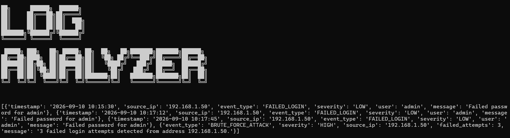

#Modular Python Log Analyzer

A simple and flexible Python tool for analyzing system and web logs. It helps identify suspicious activity and possible security issues, then saves the results for later review.



## USAGE

Follow these steps to run the log analyzer locally:

1. **Clone the repository:**
   ```bash
   git clone [https://github.com/m999888777666/log_analyzer.git](https://github.com/m999888777666/log_analyzer.git)
   cd log_analyzer
   ```

2. **Add your log file:**
   Place your target log file under the logs/ directory (e.g., logs/sample.log).

3. **Run the analyzer:**
   python main.py

4. **View Findings:**
   Check the generated report in output/findings.csv
